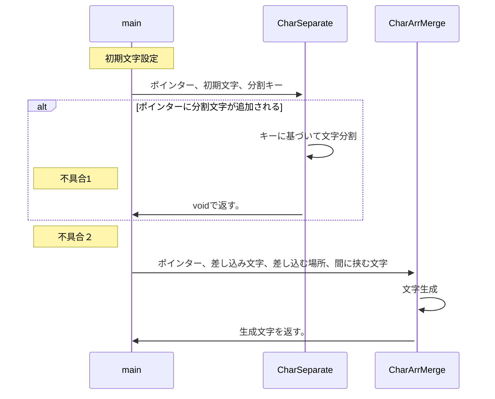
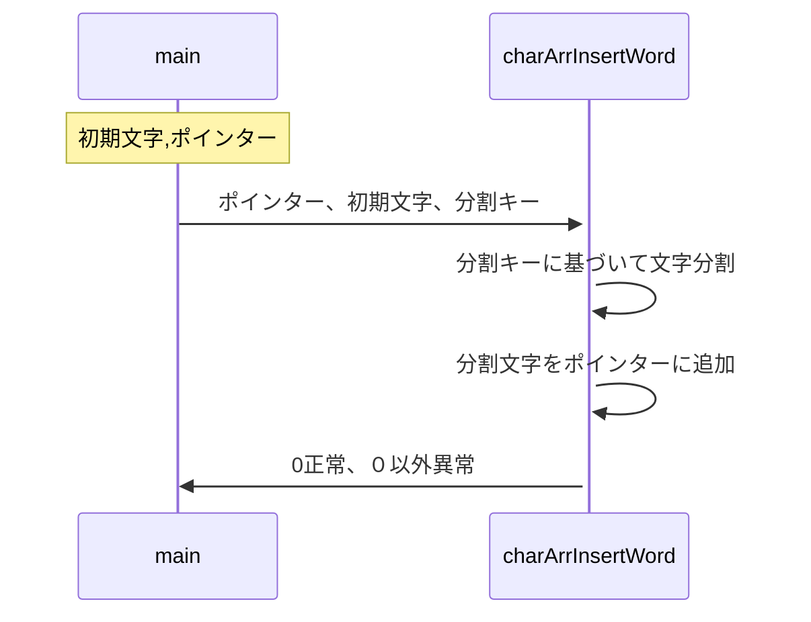

# 備忘録

## 構想
あるkey文字で区切られた文字列に対して、  
文字を差し込み、key文字で閉じるコードを作りたい。  
ex)key文字：@、差し込み文字：AAA
XXX@YY@ZZ → XXX@YY@AAAA@ZZ


↑完成できず


↑完成

## 不具合
1. CharSeparateで分割した配列の０列目が空？？？  
一旦無かったことに
1. CharArrMergeで↓のエラーメッセージが出る。  
一旦無かったことに  
ISO C++ forbids converting a string constant to 'char*' [-Wwrite-strings]

1. ~~resultの先頭にaが入る。~~  
**resultに初期値入れると解決**
```
ptr WWWW count 0
ptr XXX count 1 
ptr YY count 2
ptr Z.csv count 3
ptr (null) count 4
result aWWWW@XXX@YY@FLOW1@Z.csv
```

## 参考URL
[マークダウンでフローチャート](https://qiita.com/yoktave-yoknel/items/b923fe2b9206beab700c)  
[+α](https://shd101wyy.github.io/markdown-preview-enhanced/#/ja-jp/diagrams)