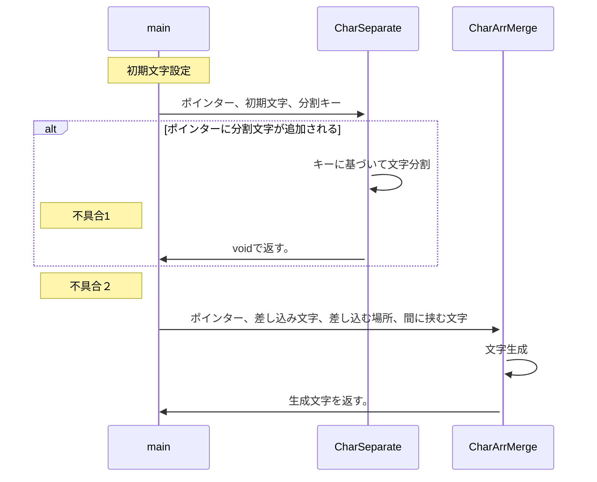

# 備忘録

## 構想

## 不具合
1. CharSeparateで分割した配列の０列目が空？？？
2. CharArrMergeで↓のエラーメッセージが出る。  
ISO C++ forbids converting a string constant to 'char*' [-Wwrite-strings]

## 参考URL
[マークダウンでフローチャート](https://qiita.com/yoktave-yoknel/items/b923fe2b9206beab700c)  
[+α](https://shd101wyy.github.io/markdown-preview-enhanced/#/ja-jp/diagrams)